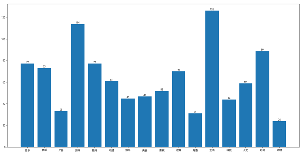

<h1 style="text-align: center">Bilibili 弹幕数据分析</h1>

## 1 数据获取及预处理

### 1.1 数据爬取

​		弹幕数据一般并不直接存在于视频观看页面的网页源代码中。类似于动态网页的加载，我们需要模拟浏览器发出请求，抓取数据。具体流程如下：

1. 视频网页的URL格式： `https://www.bilibili.com/video/av + ‘视频ID’` 

2. 分析网页结构，可知弹幕数据储存在一个XML文件中，想要抓取此数据包，需要从网页源代码中用正则方法获取视频的`cid`码，弹幕XML文件的URL如下：`http://comment.bilibili.com/' + ‘cid’+ ‘.xml'`，模拟浏览器访问URL，下载弹幕数据，实现弹幕数据的获取。

   在B站爬取了1000多个视频的弹幕数据，将其分成16个视频类别，数据分布如下图：

  

### 1.2 数据预处理以及特征工程

1. 解析XML：采用 `bs4(Beautiful Soup 4)` 网页解析工具

   > Beautiful Soup将复杂HTML文档转换成一个复杂的树形结构，通过对文档树遍历搜索解析出弹幕。

2. 中文分词：采用 `jieba` 分词工具，分词同时去除分词结果中常见的中文停用词，缺失值，进行数据清洗。

   > jieba分词模型基于 Trie 树结构实现高效的词图扫描，生成句子中汉字所有可能成词情况所构成的有向无环图，同时采用了动态规划查找最大概率路径, 找出基于词频的最大切分组合，对与没有收录在词典中的词语jieba分词模型使用Viterbi算法，采用基于汉字成词能力的HMM模型进行分词。

3. 特征提取：词频统计；选用 `TF-IDF`(词频-逆文件频率)为视频弹幕的特征值。

   > TF-IDF是一种用于资讯检索与资讯探勘的常用加权技术。TF-IDF是一种统计方法，用以评估一个字词对于一个文件集或一个语料库中的其中一份文件的重要程度。字词的重要性随着它在文件中出现的次数成正比增加，但同时会随着它在语料库中出现的频率成反比下降。

4. 对于视频的标签数据，我们参考 Bilibili 官方分类，对视频进行人工标注，将其分为以下16类：

   | 音乐 | 数码 | 动漫 | 美食 | 广告 | 影视 | 教育 | '鬼畜 |
   | ---- | ---- | ---- | ---- | ---- | ---- | ---- | ----- |
   | 生活 | 科技 | 人文 | 娱乐 | 时尚 | 动物 | 舞蹈 | 游戏  |

5. 然后将这16类的视频标签转换为one-hot编码

## 2 文本分类

| 分类方法            | Kappa（使用TF-IDF） | Kappa（使用词频）  |
| ------------------- | ------------------- | ------------------ |
| Knn                 | 0.5474925444760568  | 0.2884712469594751 |
| Naïve Bayes         | ————                | 0.5729240328769665 |
| LinearSVC           | 0.6458523192635575  | 0.4971856978085352 |
| Logistic regression | 0.4719306306624724  | 0.5853650090040172 |

## 3 数据可视化

通过特征工程中构建的基于词频的词袋模型，我们可以获知视频弹幕的高频词语，将这些词语进行筛选，通过数据可视化的方式构建词云标签。

  
